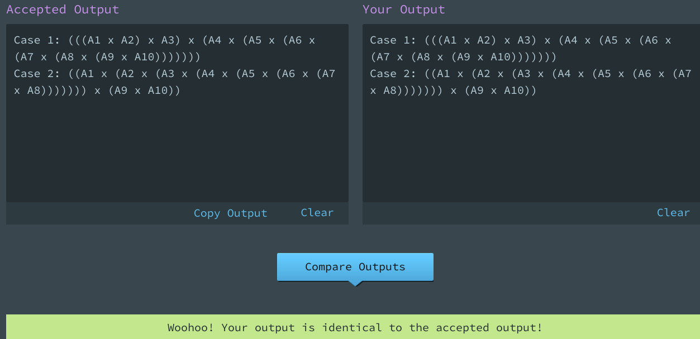
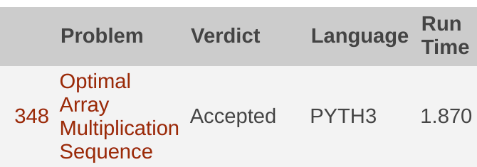

[](https://classroom.github.com/a/15l3eOhq)
# UVA-348 - Optimal Array Multiplication Sequence

## Tercera Práctica: Programación Dinámica
Problema que consiste en identificar cuál es el número mínimo de operaciones que hay que realizar para multiplicar una secuencia de matrices. El objetivo de esta práctica es resolver un problema utilizando programación dinámica.

## Nombres de los estudiantes
- Juan Andrés Young Hoyos
- Mateo Villada Higuita

## Aceptado por Udebug


## Aceptado por onlineJudge


## Correr el código
Este código lo pude correr usando en la terminal este comando:
```bash
cat input.txt | python3 main.py
```

# Documento de la solución
[Optimal Array Multiplication Sequence](Optimal_Array_Multiplication_Sequence.pdf)

## Evaluación

La evaluación está organizada de la siguiente manera:

20% - El programa debe pasar todos los casos de prueba de udebug [uDebug - UVA 348 Optimal Array Multiplication Sequence](https://www.udebug.com/Uva/348). Recuerden que si se registran en udebug, tienen acceso a sugerencias sobre el problema.

40% - El programa debe para los casos de prueba del onlinejudge de UVA ([Online Judge - 348 - Optimal Array Multiplication Sequence](https://onlinejudge.org/index.php?option=com_onlinejudge&Itemid=8&category=5&page=show_problem&problem=284))

40% - La explicación de la solución utilizada y la calidad del código. Esto incluye:
1. Descripción del algoritmo. ¿Por qué funciona?
2. Descripción del mecanismo recursivo: ¿Cuál es la variable que determina el tamaño del problema? ¿Cuáles son los casos triviales? ¿Cuál es la relación de recurrencia?
3. Se revisará también la calidad del código. Algunos ejemplos de cosas que se penalizan:
    * Utilizar variables globales
    * Incluir en los ciclos cálculos que no cambian en cada iteración
    * Nombres arbitrarios de variables o funciones (aleatorios o sin ninguna relación con la semántica de la variable o la función)
# Optimal_array_matrix_multiplication
